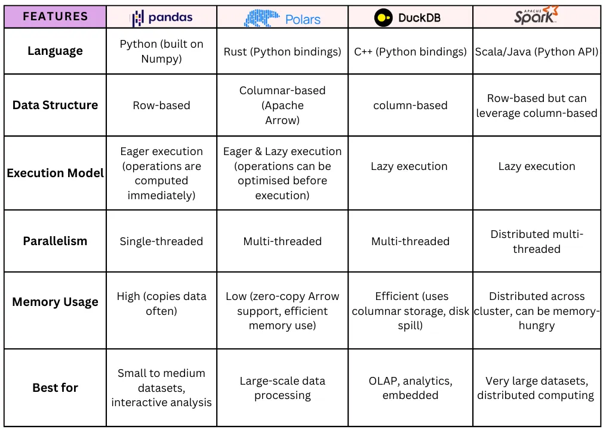

Spark is an Apache technology for distributed computing, even on weak hardware. It uses JVM and Scala. PySpark is the Python interface to it.

Uses map-reduce: tasks are split, processed in parallel, and results are combined. Designed for clusters and large datasets.

PySpark allows two main options for working with data:

- SQL queries (via temporary views).
- DataFrame API (Pythonic, lazy evaluation).

## Comparison to other solutions

Spark has significant performance overhead when starting the runtime and splitting the main task. Of course, the best results are in large clusters.

Simple rules:

- Polars are better than pandas (multithreaded, lazy evaluation).
- Polars and DuckDB are suitable for single machine workloads—data size up to a few gigabytes max.
- PySpark excels in cluster infrastructure with terabytes of data.
- Single machine PySpark is suitable for testing, but not practical for production.




## Architecture examples

### Sum

We need to calculate sum of two columns (A, B).

1) Driver decide which file will be process by which worker
2) Each worker read his files and sum given columns and return something like: `{'sumA': 1_000_000, 'sumB': 500_000}`
3) Driver collect all results and calculate final sums

### Avg

Avg can sounds pretty similar to sum. But with same approach we will get wrong answer:


## Data shufle

### Miscellaneous

The `OPTIMIZE` command **compacts small files into larger ones** for better access patterns. `Z-Order` indexing further sorts data based on specific columns to improve query pruning. Both operations require substantial computational resources for scanning and writing data. Therefore, compute-optimized resources provide the necessary CPU power and parallelism to efficiently process these tasks. While storage and memory are important, the main bottleneck during optimization is **CPU-intensive compute operations**. Operation is **idempotent**.

```SQL
OPTIMIZE table_name [FULL] [WHERE predicate] [ZORDER BY (col_name1 [, ...] ) ]
```

Running the `VACUUM` command on a Delta table deletes the unused data files older than a specified data retention period. As a result, you lose the ability to time travel back to any version older than that retention threshold.

```SQL
VACUUM table_name { { FULL | LITE } | DRY RUN } [...]
```

The retention period is fixed at **7 days**.

### JSON

There are 3 options how to handle JSON in column:

1. Store as a string, it is easy but not efficient.
    Query with path syntax: `SELECT json_col:address:city FROM table`
2. Use `Struct` type, better for fixed schema.
    Derive schema: `SELECT schema_of_json('sample-json-string')`
    Convert JSON to struct: `SELECT from_json(json_col, 'json-struct-schema') AS struct_column FROM table`
3. Use `Variant` type, it combinate advantages of both.
    Store any JSON structure, flexible schema.
    Parse: `parse_json( jsonStr )`
    Query with path syntax: `SELECT variant_col:address:city FROM table`
