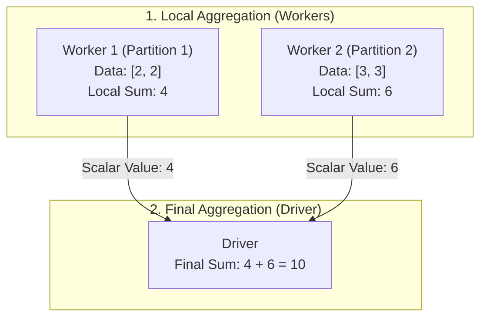
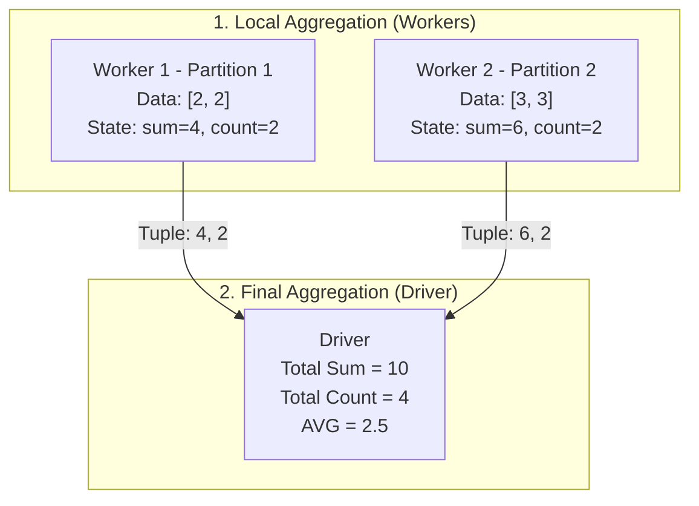
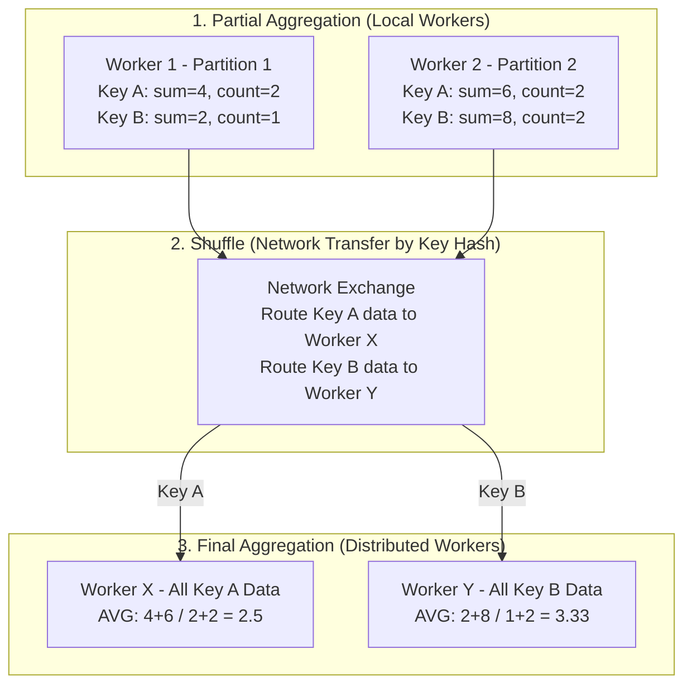

Spark is an Apache technology for distributed computing, even on weak hardware. It uses JVM and Scala. PySpark is the Python interface to it.

Uses map-reduce: tasks are split, processed in parallel, and results are combined. Designed for clusters and large datasets.

PySpark allows two main options for working with data:

- SQL queries (via temporary views).
- DataFrame API (Pythonic, lazy evaluation).

## Comparison to other solutions

Spark has significant performance overhead when starting the runtime and splitting the main task. Of course, the best results are in large clusters.

Simple rules:

- Polars are better than pandas (multithreaded, lazy evaluation).
- Polars and DuckDB are suitable for single machine workloads—data size up to a few gigabytes max.
- PySpark excels in cluster infrastructure with terabytes of data.
- Single machine PySpark is suitable for testing, but not practical for production.

| Features | Pandas| Polars | DuckDB | Spark |
| ------- | ------- | ------- | ------- | ------- |
| Language | Python (build on Numpy) | Rust (Python bindings) | C++ (Python bindings) | Scala/JVM (Python API) |
| Data structure | Row base | Columnar (Arrow) | Columnar | Columnar (Arrow) |
| Execution model | Eager | Eager & Lazy | Lazy | Lazy |
| Parallelism | Single thread | Multi thread | Multi thread | Distributed multi thread |
| Memory usage | High | Low | Efficient | |
| Best for | small to medium datasets | datasets that fit RAM | OLAP | big OLAP |


## How functions are calculate

| Aggregation Type | Intermediate Result Description | Typical Functions | Complexity / Shuffle Risk |
| --- | --- | --- | --- |
| **Distributive** | Same data type as the final scalar result (e.g., single value). | `SUM`, `MIN`, `MAX`, `COUNT` | **Low** (No Shuffle needed without `groupBy`) |
| **Algebraic** | Fixed-size tuple/structure representing intermediate state. | `AVG` (sum, count), `STDDEV`, `VAR` | **Low** (No Shuffle needed without `groupBy`) |
| **Holistic** | Cannot be reduced to a fixed-size state; requires the complete dataset. | `MEDIAN`, `PERCENTILE` | **High** (Always requires Shuffle and global sorting) |

### Sum



### Avg



### GroupBy Aggregation

When performing a `groupBy`, Spark executes a **Shuffle** to repartition data across the cluster so that all records sharing the same key end up on the same worker node. Unlike simple global aggregations where the Driver computes the final scalar value, `groupBy` keeps the final aggregation distributed across the worker nodes.

**Execution Steps**

1. **Partial Aggregation:** Each worker locally aggregates data in memory within its own partitions.
2. **Shuffle / Exchange:** Intermediate data is transferred across the network. A hash function on the grouping key determines which worker receives which key.
3. **Final Aggregation:** Target workers collect all intermediate states for their assigned keys and compute the final aggregated result in parallel.



## Data shuffle

Shuffle is the process of redistributing data across cluster nodes so that all rows sharing the same key end up on the same worker node. Because it involves writing intermediate files, transmitting data over the network, and sorting it at the destination, it is the most resource-intensive and performance-critical operation in Apache Spark.

1. **Map-Side Disk Write:** Workers serialize local intermediate results and write them to temporary local disk storage to ensure reliability during network transfers.
2. **Serialization:** Data is converted from JVM objects into raw binary streams for efficient network transmission.
3. **Network Transfer:** Data chunks are fetched across cluster nodes based on hash partitioning.
4. **Sort & Merge (Reduce-Side):** Receiving workers deserialize the incoming streams, sort them, and merge them in memory to form the new target partitions.

**Operations That Trigger a Shuffle**

* **Grouping:** `groupBy()`, `groupByKey()`
* **Joins:** `join()` (unless optimized using a Broadcast Join)
* **Deduplication:** `distinct()`
* **Repartitioning:** `repartition()` (unlike `coalesce()`, which avoids a full shuffle when reducing partition counts)
* **Key-Based Aggregations:** `reduceByKey()`, `aggregateByKey()`

### Miscellaneous

The `OPTIMIZE` command **compacts small files into larger ones** for better access patterns. `Z-Order` indexing further sorts data based on specific columns to improve query pruning. Both operations require substantial computational resources for scanning and writing data. Therefore, compute-optimized resources provide the necessary CPU power and parallelism to efficiently process these tasks. While storage and memory are important, the main bottleneck during optimization is **CPU-intensive compute operations**. Operation is **idempotent**.

```SQL
OPTIMIZE table_name [FULL] [WHERE predicate] [ZORDER BY (col_name1 [, ...] ) ]
```

Running the `VACUUM` command on a Delta table deletes the unused data files older than a specified data retention period. As a result, you lose the ability to time travel back to any version older than that retention threshold.

```SQL
VACUUM table_name { { FULL | LITE } | DRY RUN } [...]
```

The retention period is fixed at **7 days**.

### JSON

There are 3 options how to handle JSON in column:

1. Store as a string, it is easy but not efficient.
    Query with path syntax: `SELECT json_col:address:city FROM table`
2. Use `Struct` type, better for fixed schema.
    Derive schema: `SELECT schema_of_json('sample-json-string')`
    Convert JSON to struct: `SELECT from_json(json_col, 'json-struct-schema') AS struct_column FROM table`
3. Use `Variant` type, it combinate advantages of both.
    Store any JSON structure, flexible schema.
    Parse: `parse_json( jsonStr )`
    Query with path syntax: `SELECT variant_col:address:city FROM table`
