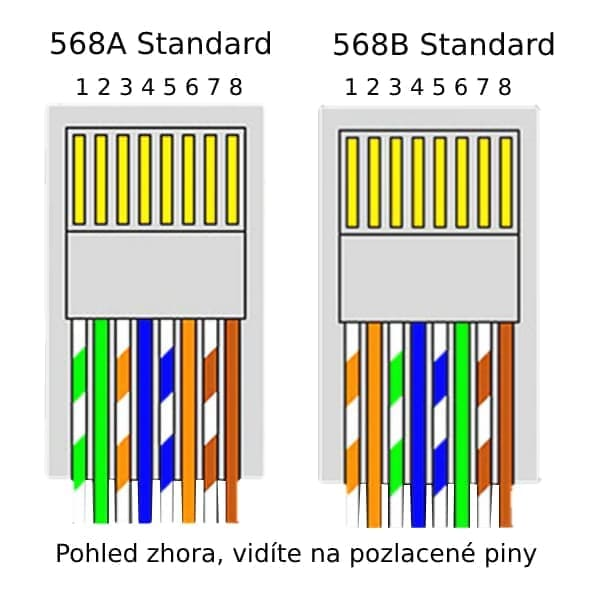

## Ethernet

| Category   |	Max. Data Rate| 	Bandwidth |	Max. distance |	Usage|
|------------|---------------:|------------:|---------------:|-------------------------------|
| Category 5 |      100 Mbps	|     100 MHz |	100 m |	100BaseT Ethernet |
| Category 5e| 	       1 Gbps | 	  100 MHz |	100 m |	100BaseT Ethernet, residential homes |
| Category 6 |	       1 Gbps |	    250 MHz |	100 m |	Gigabit Ethernet, commercial buildings |
| Category 6a|  	    10 Gbps |	    500 MHz |	100 m | Gigabit Ethernet in data centers and commercial buildings |



| # | 	Type 568A |	Type 568B |
|---|-------------|-------------|
| 1.| bílo - zelený | 	bílo - oranžový |
| 2.| zelený 	 | oranžový| 
| 3.| bílo - oranžový |	bílo - zelený|
| 4.| modrý     |	modrý |
| 5.|  	modro - bílý |	modro - bílý|
| 6.|  	oranžový 	|zelený|
| 7.|  	bílo - hnědý |	bílo - hnědý|
| 8.|  	hnědý |	hnědý|

## Tailscale

[Tailscale](https://tailscale.com/) has proprietary control plane, but the data plane is based on open source WireGuard. It creates a mesh VPN between your devices, making them accessible to each other securely over the internet. There is opensource alternative for control plane [Headscale](https://headscale.net/).

It will create virtual network interface `tailscale0` on each device. Each device gets its own stable IP address in the `100.x.y.z` range. If you enable `--ssh` you can SSH to other devices using Tailscale IP or hostname (e.g. `device-name.tailcale.net`).

```console
sudo dnf install tailscale
sudo systemctl up tailscaled --ssh # one time with SSH
sudo systemctl enable tailscaled   # on boot
ip addr show tailscale0

tailscale ping <other-device>
```

```powershell
winget install Tailscale.Tailscale
```

## Desktop sharing

Server: [Sunshine](https://github.com/LizardByte/Sunshine)
Client: [Moonlight](https://moonlight-stream.org/)

Great with combination with Tailscale for secure access over the internet. Even for gaming.

```powershell
winget install LizardByte.Sunshine
```
